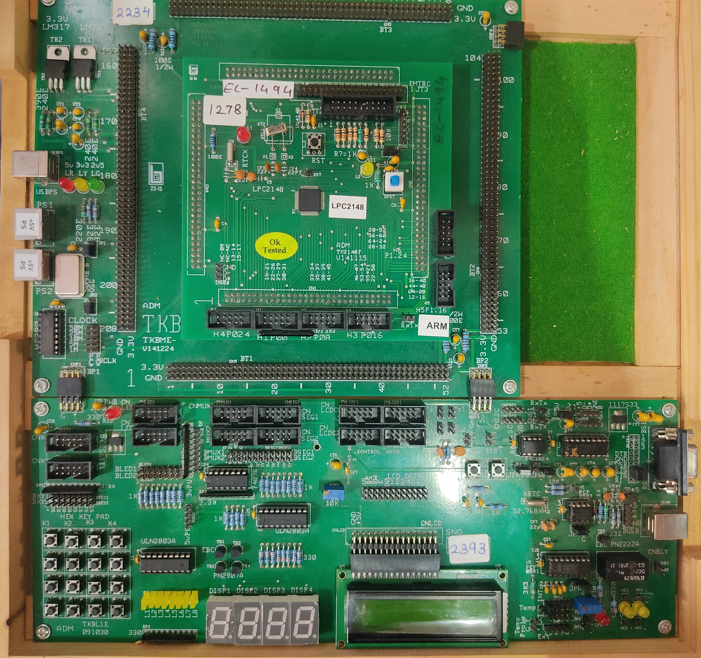

# Interfacing

<em> LPC2148 Trainer Kit </em>

Create folders for each of the experiments with the source file and its circuit diagram

## Programs List

1. Blinking LEDs
1. 4 Digit counter
1. Display a message on an LCD
1. Keypad interfacing to a 7 segment display
1. Signal generator using DAC
1. Stepper motor ( Theory Only )
1. ADC ( Theory Only )
1. UART ( Theory Only )
1. I2C ( Theory Only )

## Procedure
### Generating the executable
1. Create a folder with the experiment name with the "lpc214x.h" header file in it.
1. Open IAR
1. Project -> New -> Project templates -> C -> main
1. Project Name
      - Options 
        - General
          - Core -> ARM7TDMI
          - Device -> NXP LPC2148
        - Output converter
          - O/P format -> Intel Extended HEX
      - Add file -> lpc214x.h
 1. Write the code & save & make
 
 ### Dumping the executable
 1. Connect the board & find its COM port to the computer
 1. Open Flash Magic
 1. Set the proper COM port & Hex file path
 1. On the board - hit the DPDT switch & press reset (program mode)
 1. Click on Start on Flash Magic
 1. After downloading, release the DPDT switch & press reset (run mode)
 
___
Made with :heart: by [spacebiz24](https://github.com/spacebiz24) and [Eloquencere](https://github.com/Eloquencere)
